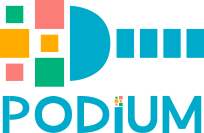

<div align="center">
    <br>
    
    <p>
    A framework agnostic Python NLP library for data loading and preprocessing.
    <br>
</div>
<p align="center">
    <a href="https://github.com/TakeLab/podium/actions">
        
    </a>
    <a href="https://github.com/TakeLab/podium/blob/master/LICENSE">
        
    </a>
    <a href="http://takelab.fer.hr/podium/">
        
    </a>
    <a href="https://github.com/TakeLab/podium/releases">
        
    </a>
    <br>
</p>

## What is Podium?

Podium is a framework agnostic Python natural language processing library which standardizes data loading and preprocessing.
Our goal is to accelerate users' development of NLP models whichever aspect of the library they decide to use. 

We desire Podium to be **lightweight**, in terms of code and dependencies, **flexible**, to cover most common use-cases and easily adapt to more specific ones and **clearly defined**, so new users can quickly understand the sequence of operations and how to inject their custom functionality.

Check out our [documentation](http://takelab.fer.hr/podium/) for more details. 
The main source of inspiration for Podium is an old version of [torchtext](https://github.com/pytorch/text).

### Contents

- [Installation](#installation)
- [Usage examples](#usage)
- [Contributing](#contributing)
- [Versioning](#versioning)
- [Authors](#authors)
- [License](#license)

## Installation

### Installing from pip

You can install `podium` using pip

```bash
pip install podium-nlp
```

### Installing from source

Commands to install `podium` from source

```bash
git clone git@github.com:TakeLab/podium.git && cd podium
pip install .
```

For more detailed installation instructions, check the [installation page](https://takelab.fer.hr/podium/installation.html) in the documentation.

## Usage

### Loading datasets

Use some of our pre-defined datasets:

```python
>>> from podium.datasets import SST
>>> sst_train, sst_dev, sst_test = SST.get_dataset_splits()
>>> sst_train.finalize_fields() # Trigger vocab construction
>>> print(sst_train)
SST({
    size: 6920,
    fields: [
        Field({
            name: text,
            keep_raw: False,
            is_target: False,
            vocab: Vocab({specials: ('<UNK>', '<PAD>'), eager: False, is_finalized: True, size: 16284})
        }),
        LabelField({
            name: label,
            keep_raw: False,
            is_target: True,
            vocab: Vocab({specials: (), eager: False, is_finalized: True, size: 2})
        })
    ]
})
>>> print(sst_train[222]) # A short example
Example({
    text: (None, ['A', 'slick', ',', 'engrossing', 'melodrama', '.']),
    label: (None, 'positive')
})
```

Load datasets from [🤗 datasets](https://github.com/huggingface/datasets):

```python
>>> from podium.datasets.hf import HFDatasetConverter as HF
>>> import datasets
>>> # Load the huggingface dataset
>>> imdb = datasets.load_dataset('imdb')
>>> print(imdb.keys())
dict_keys(['train', 'test', 'unsupervised'])
>>> # Wrap it so it can be used in Podium (without being loaded in memory!)
>>> imdb_train, imdb_test, imdb_unsupervised = HF.from_dataset_dict(imdb).values()
>>> # We need to trigger Vocab construction
>>> imdb_train.finalize_fields()
>>> print(imdb_train)
HFDatasetConverter({
    dataset_name: imdb,
    size: 25000,
    fields: [
        Field({
            name: 'text',
            keep_raw: False,
            is_target: False,
            vocab: Vocab({specials: ('<UNK>', '<PAD>'), eager: False, is_finalized: True, size: 280619})
        }),
        LabelField({
            name: 'label',
            keep_raw: False,
            is_target: True
        })
    ]
})
```

Load your own dataset from a standardized tabular format (e.g. `csv`, `tsv`, `jsonl`, ...):

```python
>>> from podium.datasets import TabularDataset
>>> from podium import Vocab, Field, LabelField
>>> fields = {'premise':   Field('premise', numericalizer=Vocab()),
...           'hypothesis':Field('hypothesis', numericalizer=Vocab()),
...           'label':     LabelField('label')}
>>> dataset = TabularDataset('my_dataset.csv', format='csv', fields=fields)
>>> dataset.finalize_fields() # Trigger vocab construction
>>> print(dataset)
TabularDataset({
    size: 1,
    fields: [
        Field({
            name: 'premise',
            keep_raw: False,
            is_target: False, 
            vocab: Vocab({specials: ('<UNK>', '<PAD>'), eager: False, is_finalized: True, size: 15})
        }),
        Field({
            name: 'hypothesis',
            keep_raw: False,
            is_target: False, 
            vocab: Vocab({specials: ('<UNK>', '<PAD>'), eager: False, is_finalized: True, size: 6})
        }),
        LabelField({
            name: 'label',
            keep_raw: False,
            is_target: True, 
            vocab: Vocab({specials: (), eager: False, is_finalized: True, size: 1})
        })
    ]
})
```

Check our documentation to see how you can load a dataset from [Pandas](https://pandas.pydata.org/), the CoNLL format, or define your own `Dataset` subclass (tutorial coming soon).

### Define your preprocessing

We wrap dataset pre-processing in customizable `Field` classes. Each `Field` has an optional `Vocab` instance which automatically handles token-to-index conversion.

```python
>>> from podium import Vocab, Field, LabelField
>>> vocab = Vocab(max_size=5000, min_freq=2)
>>> text = Field(name='text', numericalizer=vocab)
>>> label = LabelField(name='label')
>>> fields = {'text': text, 'label': label}
>>> sst_train, sst_dev, sst_test = SST.get_dataset_splits(fields=fields)
>>> sst_train.finalize_fields()
>>> print(vocab)
Vocab({specials: ('<UNK>', '<PAD>'), eager: False, finalized: True, size: 5000})
```

Each `Field` allows the user full flexibility to modify the data in multiple stages:
- Prior to tokenization (by using pre-tokenization `hooks`)
- During tokenization (by using your own `tokenizer`)
- Post tokenization (by using post-tokenization `hooks`)

You can also completely disregard our preprocessing and define your own by setting your own `numericalizer`.

You could decide to lowercase all the characters and filter out all non-alphanumeric tokens:

```python
>>> def lowercase(raw):
...     return raw.lower()
>>> def filter_alnum(raw, tokenized):
...     filtered_tokens = [token for token in tokenized if
...                        any([char.isalnum() for char in token])]
...     return raw, filtered_tokens
>>> text.add_pretokenize_hook(lowercase)
>>> text.add_posttokenize_hook(filter_alnum)
>>> fields = {'text': text, 'label': label}
>>> sst_train, sst_dev, sst_test = SST.get_dataset_splits(fields=fields)
>>> sst_train.finalize_fields()
>>> print(sst_train[222])
Example({
    text: (None, ['a', 'slick', 'engrossing', 'melodrama']),
    label: (None, 'positive')
})
```

**Pre-tokenization** hooks accept and modify only on `raw` data.
**Post-tokenization** hooks accept and modify `raw` and `tokenized` data.

### Use preprocessing from other libraries

A common use-case is to incorporate existing components of pretrained language models, such as BERT. This is extremely simple to incorporate as part of our `Field`s. This snippet requires installation of the `🤗 transformers` (`pip install transformers`) library.

```python
>>> from transformers import BertTokenizer
>>> # Load the tokenizer and fetch pad index
>>> tokenizer = BertTokenizer.from_pretrained('bert-base-uncased')
>>> pad_index = tokenizer.convert_tokens_to_ids(tokenizer.pad_token)
>>> # Define a BERT subword Field
>>> subword_field = Field(name="subword",
...                       padding_token=pad_index,
...                       tokenizer=tokenizer.tokenize,
...                       numericalizer=tokenizer.convert_tokens_to_ids)
>>> fields = {'text': subword_field, 'label': label}
>>> sst_train, sst_dev, sst_test = SST.get_dataset_splits(fields=fields)
>>> # No need to finalize since we're not using a vocab!
>>> print(sst_train[222])
Example({
    subword: (None, ['a', 'slick', ',', 'eng', '##ross', '##ing', 'mel', '##od', '##rama', '.']),
    label: (None, 'positive')
})
```

For a more interactive introduction, check out the quickstart on Google Colab: [](https://colab.research.google.com/github/takelab/podium/blob/master/docs/source/notebooks/quickstart.ipynb)

Full usage examples can be found in our [docs](https://takelab.fer.hr/podium/) under the **Examples** heading.

## Contributing

We welcome contributions! To learn more about making a contribution to Podium, please see our [Contribution page](CONTRIBUTING.md) and our [Roadmap](ROADMAP.md).

## Versioning

We use [SemVer](http://semver.org/) for versioning. For the versions available, see the [tags on this repository](../../tags). 

## Authors

* Podium is currently maintained by [Ivan Smoković](https://github.com/ivansmokovic), [Mario Šaško](https://github.com/mariosasko), [Filip Boltužić](https://github.com/FilipBolt), and [Martin Tutek](https://github.com/mttk). A non-exhaustive but growing list of collaborators: [Silvije Skudar](https://github.com/sskudar), [Domagoj Pluščec](https://github.com/domi385), [Marin Kačan](https://github.com/mkacan), [Dunja Vesinger](https://github.com/dunja-v), [Mate Mijolović](https://github.com/matemijolovic).
* Thanks to the amazing [Mihaela Bošnjak](https://github.com/Bmikaella) for the logo!
* Project made as part of [TakeLab](https://takelab.fer.hr) at Faculty of Electrical Engineering and Computing, University of Zagreb.

See also the list of [contributors](../../graphs/contributors) who participated in this project.

## License

This project is licensed under the BSD 3-Clause - see the [LICENSE](LICENSE) file for details.
