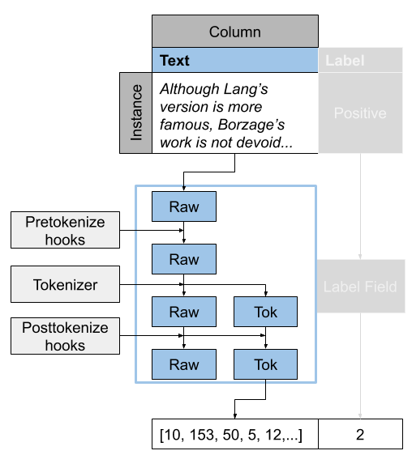

The Podium data flow
====================

In Podium, data exists in three states: **raw** (as read from the dataset), **processed** (once the tokenizer and additional postprocessing have been applied) and **numericalized** (converted to indices).

The data is processed immediately when the instance is loaded from disk and then stored in the Example class. Each instance of an Example (a shallow wrapper of a python dictionary) contains one instance of the dataset. Both the `raw` and `processed` data are stored as a tuple attribute under the name of the Field in an Example. You can see this in the SST example:

.. code-block:: python

  >>> from podium.datasets import SST
  >>> sst_train, sst_test, sst_dev = SST.get_dataset_splits()
  >>> print(sst_train[222]) 
  Example[label: (None, 'positive'); text: (None, ['A', 'slick', ',', 'engrossing', 'melodrama', '.'])]

We can unpack the Example class with the bracket notation, as you would a dictionary.

.. code-block:: python

  >>> text_raw, text_processed = sst_train[222]['text']
  >>> label_raw, label_processed = sst_train[222]['label']
  >>> print(text_raw, text_processed)
  >>> print(label_raw, label_processed)
  None ['A', 'slick', ',', 'engrossing', 'melodrama', '.']
  None positive

What are the ``None`` s? This is the `raw` data, which by default isn't stored in Examples to save memory. If you want to keep the raw data as well (e.g. for future reference), you have to set the ``keep_raw=True`` in the corresponding Field.

.. code-block:: python

  >>> from podium import Vocab, Field, LabelField
  >>> text = Field(name='text', numericalizer=Vocab(), keep_raw=True)
  >>> label = LabelField(name='label')
  >>> fields = {'text': text, 'label': label}
  >>>
  >>> sst_train, sst_test, sst_dev = SST.get_dataset_splits(fields=fields)
  >>> print(sst_train[222].text)
  ('A slick , engrossing melodrama .', ['A', 'slick', ',', 'engrossing', 'melodrama', '.'])

We can see that now we also have the pre-tokenized text available to us. In the case of SST this is not very useful because the tokenizer is simply ``str.split``, an easyily reversible function. In the case of non-reversible tokenizers (e.g. the ones in ``spacy``), you might want to keep the raw instance for future reference.

How to interact with Fields
===========================

In the previous section, we could see that text from the SST dataset is both in uppercase as well as lowercase. Apart from that, we might not want to keep punctuation tokens, which we can also see in the processed data. These are two cases for which we have designed pretokenization and posttokenization **hooks**.

As we said earlier, data in Podium exists in three states: raw, processed and numericalized. You can intervene and add a custom transformation between each of these three states. Functions which modify raw data prior to tokenization are called **pretokenization hooks**, while functions which modify processed data prior to numericalization are called **posttokenization hooks**. We can see the Field process visualized for the text Field in the following image:

Pretokenization hooks have the following signature:

.. code-block:: python

  >>> def pretokenization_hook(raw):
  >>>   raw = do_something(raw)
  >>>   return raw

Each pretokenization hook accepts one argument, the raw data for that instance, and returns one output, the modified raw data. The raw data is then updated accordingly in the Example instance. Posttokenization hooks follow a similar signature:

.. code-block:: python

  >>> def posttokenization_hook(raw, processed):
  >>>   processed = do_something(raw, processed)
  >>>   return raw, processed

Each posttokenization hook accepts two arguments, the raw and processed data for that instance and returns two outputs, which are the modified raw and tokenized data. Both of those are then updated in the Example instance for that data Field in each dataset instance.
If we want to define some text processing which requires some external attribute (e.g. storing the list of stop words for removing stop words), our hook can be a class as long as it implements the ``__call__`` method.

.. code-block:: python

  >>> class Pretokenization_hook:
  >>>   def __init__(self, metadata):
  >>>     self.metadata = metadata
  >>>
  >>>   def __call__(self, raw):
  >>>     raw = do_something(raw, metadata)
  >>>     return raw

Let's now define a few concrete hooks and use them in our dataset.

Lowercase as a pretokenization hook
-----------------------------------

We will first implement a pretokenization hook which will lowercase our raw data. Please beware that casing might influence your tokenizer, so it might be wiser to implement this as a posttokenization hook. In our case however, the tokenizer is ``str.split``, so we are safe. This hook is going to be very simple:

.. code-block:: python

  >>> def lowercase(raw):
  >>>   """Lowercases the input string"""
  >>>   return raw.lower()

And we're done! We can now add our hook to the text field either through the :meth:`podium.storage.Field.add_pretokenize_hook` method of the Field or through the ``pretokenize_hooks`` constructor argument. We will first define a posttokenization hook which removes punctuation and then apply them both to our text Field.

Removing punctuation as a posttokenization hook
-----------------------------------------------

We will now similarly define a posttokenization hook to remove punctuation. We will use the punctuation list from python's built-in ``str`` module, which we will store as an attribute of our hook.

.. code-block:: python

  >>> import string
  >>> class RemovePunct:
  >>>   def __init__(self):
  >>>     self.punct = set(string.punctuation)
  >>>
  >>>   def __call__(self, raw, tokenized):
  >>>     """Remove punctuation from tokenized data"""
  >>>     return raw, [tok for tok in tokenized if tok not in self.punct]

Putting it all together
-----------------------

.. code-block:: python

  >>> text = Field(name='text', numericalizer=Vocab(), 
  >>>              keep_raw=True,
  >>>              pretokenize_hooks=[lowercase],
  >>>              posttokenize_hooks=[RemovePunct()])
  >>> label = LabelField(name='label')
  >>> fields = {'text': text, 'label': label}
  >>>
  >>> sst_train, sst_test, sst_dev = SST.get_dataset_splits(fields=fields)
  >>> print(sst_train[222])
  ('a slick , engrossing melodrama .', ['a', 'slick', 'engrossing', 'melodrama'])

We can see that our hooks worked: the raw data was lowercased prior to tokenization, and the punctuation is not present in the processed data. You can similarly define other hooks and pass them as arguments to your Fields. It is important to take care of the order in which you pass the hooks -- they will be executed in the same order as you passed them to the constructor, so take care that you don't modify some aspect of data crucial for your next hook.

We have prepared a number of predefined hooks which are ready for you to use. You can see them here: :ref:`predefined-hooks`.

Special tokens
===============
We have earlier mentioned special tokens, but now is the time to elaborate on what exactly they are. In Podium, each special token is a subclass of the python ``str`` which also encapsulates the functionality for adding that special token in the tokenized sequence. The Vocab handles special tokens differently -- each special token is guaranteed a place in the Vocab, which is what makes them... *special*.

Since our idea of special tokens was made to be extensible, we will take a brief look at how they are implemented, so we can better understand how to use them. We mentioned that each special token is a subclass of the python string, but there is an intermediary -- the :class:`podium.storage.vocab.Special` base class. The ``Special`` base class implements the following functionality, while still being an instance of a string:

  1. Extending the constructor of the special token with a default value functionality. The default value for each special token should be set via the ``default_value`` class attribute, while if another value is passed upon creation, it will be used.
  2. Adds a stub ``apply`` method which accepts a sequence of tokens and adds the special token to that sequence. In its essence, the apply method is a post-tokenization hook (applied to the tokenized sequence after other post-tokenization hooks) which doesn't see the raw data whose job is to add the special token to the sequence of replace some of the existing tokens with the special token. The special tokens are applied after all post-tokenization hooks in the order they are passed to the :class:`podium.storage.vocab.Vocab` constructor. Each concrete implementation of a Special token has to implement this method.
  3. Implements singleton-like hash and equality checks. The ``Special`` class overrides the default hash and equals and instead of checking for string value equality, it checks for *class name equality*. We use this type of check to ensure that each Vocab has a single instance of each Special and for simpler referencing and contains checks.

There is a number of special tokens used throughout NLP for a number of purposes. The most frequently used ones are the unknown token (UNK), which is used as a catch-all substitute for tokens which are not present in the vocabulary, and the padding token (PAD), which is used to nicely pack variable length sequences into fixed size batch tensors.
Alongside these two, common special tokens include the beginning-of-sequence and end-of-sequence tokens (BOS, EOS), the separator token (SEP) and the mask token introduced in BERT (MASK).

To better understand how specials work, we will walk through the implementation of one of special tokens implemented in Podium: the beginning-of-sequence (BOS) token.

.. code-block:: python

  >>> from podium.storage.vocab import Special
  >>> class BOS(Special):
  >>>   default_value = "<BOS>"
  >>>
  >>>  def apply(self, sequence):
  >>>      # Prepend to the sequence
  >>>      return [self] + sequence
  >>>
  >>> bos = BOS()
  >>> print(bos)
  <BOS>

This code block is the full implementation of a special token! All we needed to do is set the default value and implement the ``apply`` function. The default value is ``None`` by default and if not set, you have to make sure it is passed upon construction, like so:

.. code-block:: python

  >>> my_bos = BOS("<MY_BOS>")
  >>> print(my_bos)
  <MY_BOS>
  >>> print(bos == my_bos)
  True

We can also see that although we have changed the string representation of the special token, the equality check will still return True due to the ``Special`` base class changes mentioned earlier.

To see the effect of the ``apply`` method, we will once again take a look at the SST dataset:

.. code-block:: python

  >>> from podium import Vocab, Field, LabelField
  >>> from podium.datasets import SST
  >>> 
  >>> vocab = Vocab(specials=(bos))
  >>> text = Field(name='text', numericalizer=vocab)
  >>> label = LabelField(name='label')
  >>> fields = {'text': text, 'label': label}
  >>> sst_train, sst_test, sst_dev = SST.get_dataset_splits(fields=fields)
  >>> print(sst_train[222].text)
  (None, ['<BOS>', 'A', 'slick', ',', 'engrossing', 'melodrama', '.'])

Where we can see that the special token was indeed added to the beginning of the tokenized sequence.

Finally, it is important to note that there is an implicit distinction between special tokens. The unknown (:class:`podium.storage.vocab.UNK`) and padding (:class:`podium.storage.vocab.PAD`) special tokens are something we refer to as **core** special tokens, whose functionality is hardcoded in the implementation of the Vocab due to them being deeply integrated with the way iterators and numericalization work.
The only difference between normal and core specials is that core specials are added to the sequence by other Podium classes (their behavior is hardcoded) instead of by their apply method.

Custom numericalization functions
===========================================

It is often the case you want to use a predefined numericalization function, be it a Vocabulary obtained from another repository or one with functionality which our Vocab doesn't cover.

To do that, you should pass your own callable function as the ``numericalizer`` for the corresponding Field. Please also beware that in this case, you also need to define the padding token index in order for Podium to be able to batch your data. A common example, where you want to use a tokenizer and a numericalization function from a pretrained BERT model using the ``huggingface/transformers`` library can be implemented as follows:

.. code-block:: python

  >>> from transformers import BertTokenizer
  >>> tokenizer = BertTokenizer.from_pretrained('bert-base-uncased')
  >>> pad_index = tokenizer.convert_tokens_to_ids(tokenizer.pad_token)
  >>>
  >>> subword_field = Field("text",
  >>>                       padding_token=pad_index,
  >>>                       tokenizer=tokenizer.tokenize,
  >>>                       numericalizer=tokenizer.convert_tokens_to_ids)
  >>> label = LabelField('label')
  >>> fields = {'text': subword_field, 'label': label}
  >>>
  >>> sst_train, sst_test, sst_dev = SST.get_dataset_splits(fields=fields)
  >>> print(sst_train[222])
  (None, ['a', 'slick', ',', 'eng', '##ross', '##ing', 'mel', '##od', '##rama', '.'])

Fields with multiple outputs
============================

We have so far covered the case where you have a single input column, tokenize and numericalize it and then use it in your model. What if you want to obtain multiple outputs from the same input text? A common example is obtaining both words and characters for an input sequence. Let's see how we would implement this in Podium:

.. code-block:: python

  >>> from podium import Vocab, Field, LabelField
  >>> from podium.datasets import SST
  >>> char = Field(name='char', numericalizer=Vocab(), tokenizer=list)
  >>> text = Field(name='word', numericalizer=Vocab())
  >>> label = LabelField(name='label')
  >>> fields = {'text': (char, text), 'label': label}
  >>>
  >>> sst_train, sst_test, sst_dev = SST.get_dataset_splits(fields=fields)
  >>> print(sst_train[222].word, sst_train[222].char, sep='\n')
  (None, ['A', 'slick', ',', 'engrossing', 'melodrama', '.'])
  (None, ['A', ' ', 's', 'l', 'i', 'c', 'k', ' ', ',', ' ', 'e', 'n', 'g', 'r', 'o', 's', 's', 'i', 'n', 'g', ' ', 'm', 'e', 'l', 'o', 'd', 'r', 'a', 'm', 'a', ' ', '.'])

You can pass a tuple of Fields under the same input data column key, and all of the Fields will use data from input column with that name. If your output Fields share the (potentially expensive) tokenizer, we have implemented a class that optimized that part of preprocessing for you: the :class:`podium.storage.MultioutputField`.

The Multioutput Field
---------------------

Multioutput Fields are `fake` Fields which simply handle the shared pretokenization and tokenization part of the Field processing pipeline and then forward the data to the respective output Fields.

One example of such a use-case would be extracting both word tokens as well as their corresponding part-of-speech tags, both to be used as inputs to a model. For this example, we will still use the SST dataset as a demo, but we will use the spacy tokenizer.

.. code-block:: python

  >>> from podium import MultioutputField
  >>> import spacy
  >>>
  >>> # Define hooks to extract raw text and POS tags
  >>> # from spacy token objects
  >>> def extract_text_hook(raw, tokenized):
  >>>   return raw, [token.text for token in tokenized]
  >>> def extract_pos_hook(raw, tokenized):
  >>>   return raw, [token.pos_ for token in tokenized]
  >>>
  >>> # Define the output Fields and the MultioutputField
  >>> word = Field(name='word', numericalizer=Vocab(), posttokenize_hooks=[extract_text_hook])
  >>> pos = Field(name='pos', numericalizer=Vocab(), posttokenize_hooks=[extract_pos_hook])
  >>>
  >>> spacy_tokenizer = spacy.load('en', disable=['parser', 'ner'])
  >>> text = MultioutputField([word, pos], tokenizer=spacy_tokenizer)
  >>>
  >>> label = LabelField(name='label')
  >>> fields = {'text': text, 'label': label}
  >>>
  >>> sst_train, sst_test, sst_dev = SST.get_dataset_splits(fields=fields)
  >>> print(sst_train[222].word, sst_train[222].pos, sep='\n')
  (None, ['A', 'slick', ',', 'engrossing', 'melodrama', '.'])
  (None, ['DET', 'ADJ', 'PUNCT', 'VERB', 'NOUN', 'PUNCT'])

MultioutputFields accept three parameters upon construction, which encapsulate the first part of the Field processing cycle:

  - :obj:`output_fields` ``(List[Field])``: a sequence of Fields which will map tokenized data to outputs by applying posttokenization hooks and numericalization.
  - :obj:`tokenizer` ``(str | Callable)``: the tokenizer to use (keyword string or callable function). The same tokenizer will be used prior to passing data to all output Fields.
  - :obj:`pretokenization_hooks` ``(Tuple(Callable))``: a sequence of pretokenization hooks to apply to the raw data.

After tokenization, the processed data will be sent to all of the output Fields. Note that only the post-tokenization part of the output fields will be used.

Bucketing instances when iterating
==================================

When iterating over NLP datasets, it is common that instances in a batch do not have the same length. This is traditionally solved by padding all instances in a batch to the length of the longest instance. Iterating naively over instances with large variance in length will add a lot of padding.

For this reason, usage of :class:`podium.datasets.BucketIterator` is recommended. The ``BucketIterator`` uses a lookahead heuristic and sorts the instances based on a user-defined sort function. Let's take a look at a short example:

.. code-block:: python
  :emphasize-lines: 8 

  >>> from podium import Vocab, Field, LabelField
  >>> from podium.datasets import SST, IMDB
  >>> vocab = Vocab()
  >>> text = Field(name='text', numericalizer=vocab)
  >>> label = LabelField(name='label')
  >>> fields = {'text': text, 'label': label}
  >>>
  >>> train, test, valid = SST.get_dataset_splits(fields=fields)
  >>>
  >>> # Define the iterators and our sort key
  >>> from podium import Iterator, BucketIterator
  >>> def instance_length(instance):
  >>>   # Use the text Field
  >>>   raw, tokenized = instance.text
  >>>   return len(tokenized)
  >>> bucket_iter = BucketIterator(train, batch_size=32, bucket_sort_key=instance_length)

The ``bucket_sort_key`` function defines how the instances in the dataset should be sorted. The method accepts an instance of the dataset, and should return a value which will be used as a sort key in the ``BucketIterator``. It might be interesting (and surprising) to see how much space (and time) do we earn by bucketing. We will define a naive iterator on the same dataset and measure the total amount of padding used when iterating over a dataset.

.. code-block:: python

  >>> import numpy as np
  >>> vanilla_iter = Iterator(train, batch_size=32)
  >>>
  >>> def count_padding(batch, padding_idx):
  >>>   return np.count_nonzero(batch == padding_idx)
  >>> padding_index = vocab.padding_index()
  >>> 
  >>> for iterator in (vanilla_iter, bucket_iter):
  >>>   total_padding = 0
  >>>   total_size = 0
  >>>
  >>>   for batch_x, batch_y in iterator:
  >>>       total_padding += count_padding(batch_x.text, padding_index)
  >>>       total_size += batch_x.text.size
  >>>   print(f"For {iterator.__class__.__name__}, padding = {total_padding}"
  >>>         f" out of {total_size} = {total_padding/total_size:.2%}")
  For Iterator, padding = 148141 out of 281696 = 52.588961149608096%
  For BucketIterator, padding = 2125 out of 135680 = 1.5661851415094339%

As we can see, the difference between using a regular Iterator and a BucketIterator is massive. Not only do we reduce the amount of padding, we have reduced the total amount of tokens processed by about 50%. The SST dataset, however, is a relatively small dataset so this experiment might be a bit biased. Let's take a look at the same statistics for the :class:`podium.datasets.impl.IMDB` dataset. After changing the highligted data loading line in the first snippet to:

.. code-block:: python

  >>> train, test = IMDB.get_dataset_splits(fields=fields)

And re-running the code, we obtain the following, still significant improvement:

.. code-block:: python

  For Iterator, padding = 13569936 out of 19414616 = 69.89546432440385%
  For BucketIterator, padding = 259800 out of 6104480 = 4.255890755641758%

Generally, using bucketing when iterating over your NLP dataset is preferred and will save you quite a bit of processing time.
