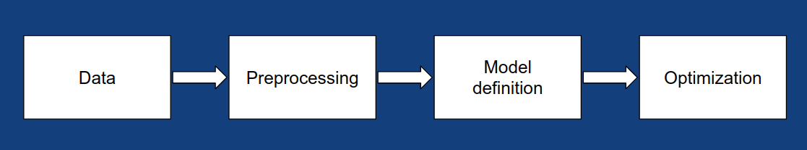

.. Podium documentation master file, created by
   sphinx-quickstart on Mon Oct  7 17:02:44 2019.
   You can adapt this file completely to your liking, but it should at least
   contain the root `toctree` directive.

Welcome to Podium's documentation!
==================================

.. toctree::
   :maxdepth: 2
   :caption: Contents:

   self
   podium.storage
   podium.datasets
   podium.dataload
   podium.preproc
   podium.metrics
   podium.model_selection
   podium.models
   podium.validation

Indices and tables
==================

* :ref:`genindex`
* :ref:`modindex`
* :ref:`search`
