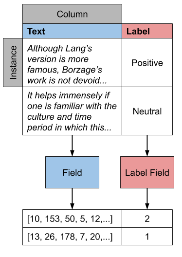

.. testsetup:: *

  from podium import Field, LabelField, Vocab, Iterator, TabularDataset
  from podium.datasets import SST
  from podium.vectorizers import GloVe, TfIdfVectorizer

Walkthrough
============

The core component of Podium is the :class:`podium.Dataset` class, a shallow wrapper which contains instances of a machine learning dataset and the preprocessing pipeline for each data field. 

Podium datasets come in three flavors:

- **Built-in datasets**: Podium contains data load and download functionality for some commonly used datasets in separate classes. See how to load built-in datasets here: :ref:`builtin-loading`.
- **Tabular datasets**: Podium allows you to load datasets in standardized format through :class:`podium.TabularDataset` and :class:`podium.datasets.arrow.DiskBackedDataset` classes. See how to load tabular datasets here: :ref:`custom-loading`.

  - Regular tabular datasets are memory-backed, while the arrow version is disk-backed.
- **HuggingFace datasets**: Podium wraps the popular `🤗 datasets <https://github.com/huggingface/datasets>`__ library and allows you to convert every 🤗 dataset to a Podium dataset. See how to load 🤗 datasets here: :ref:`hf-loading`.

.. _builtin-loading:

Loading built-in datasets
----------------------------

One built-in dataset available in Podium is the `Stanford Sentiment Treebank <https://nlp.stanford.edu/sentiment/treebank.html>`__. In order to load the dataset, it is enough to call the :func:`get_dataset_splits` method.

.. doctest:: sst
  :options: +NORMALIZE_WHITESPACE

  >>> from podium.datasets import SST
  >>> sst_train, sst_dev, sst_test = SST.get_dataset_splits() # doctest:+ELLIPSIS
  >>> print(sst_train)
  SST({
      size: 6920,
      fields: [
          Field({
              name: text,
              keep_raw: False,
              is_target: False,
              vocab: Vocab({specials: ('<UNK>', '<PAD>'), eager: False, is_finalized: True, size: 16284})
          }),
          LabelField({
              name: label,
              keep_raw: False,
              is_target: True,
              vocab: Vocab({specials: (), eager: False, is_finalized: True, size: 2})
          })
      ]
  })
  >>> print(sst_train[222]) # A short example
  Example({'text': (None, ['A', 'slick', ',', 'engrossing', 'melodrama', '.']), 'label': (None, 'positive')})

Each built-in Podium dataset has a :func:`get_dataset_splits` method, which returns the `train`, `test` and `validation` split of that dataset, if available.

The Vocabulary
---------------

We saw earlier that our dataset has two Fields: text and label. We will touch on what exactly Fields are later, but for now let's retrieve and print them out.

.. doctest:: sst

  >>> text_field, label_field = sst_train.fields
  >>> print(text_field, label_field, sep='\n')
  Field({
      name: text,
      keep_raw: False,
      is_target: False,
      vocab: Vocab({specials: ('<UNK>', '<PAD>'), eager: False, is_finalized: True, size: 16284})
  })
  LabelField({
      name: label,
      keep_raw: False,
      is_target: True,
      vocab: Vocab({specials: (), eager: False, is_finalized: True, size: 2})
  })

Inside each of these two fields we can see a :class:`podium.Vocab` class, used for numericalization (converting token strings to indices). A Vocab is defined by two maps: the string-to-index mapping :attr:`podium.Vocab.stoi` and the index-to-string mapping :attr:`podium.Vocab.itos`.

Vocabularies are built automatically for built-in datasets by counting the frequencies of tokens in the **train** set and then converting these frequences to the ``itos`` and ``stoi`` dictionaries. We can see that a ``Vocab`` is built by the ``is_finalized=True`` keyword in the printout.
If you are constructing your own dataset or loading a dataset from 🤗 (:ref:`hf-loading`), you will need to call the :func:`podium.Dataset.finalize_fields()` method to signal that the vocabularies should be constructed.

Customizing Vocabs
^^^^^^^^^^^^^^^^^^
We can customize Podium Vocabularies in one of two ways -- by controlling their constructor parameters and by defining a Vocabulary manually. 

For the latter approach, the :class:`podium.Vocab` class has two static constructors: :func:`podium.Vocab.from_itos` and :func:`podium.Vocab.from_stoi`.

.. doctest:: custom_vocab

  >>> from podium import Vocab
  >>> custom_stoi = {'This':0, 'is':1, 'a':2, 'sample':3}
  >>> vocab = Vocab.from_stoi(custom_stoi)
  >>> print(vocab)
  Vocab({specials: (), eager: True, is_finalized: True, size: 4})

This way, we can define a static dictionary which we might have obtained on another dataset to use for our current task. Similarly, it is possible to define a ``Vocab`` by a sequence of strings -- an ``itos``:

.. doctest:: custom_vocab

  >>> from podium.vocab import UNK
  >>> custom_itos = [UNK(), 'this', 'is', 'a', 'sample']
  >>> vocab = Vocab.from_itos(custom_itos)
  >>> print(vocab)
  Vocab({specials: ('<UNK>',), eager: True, is_finalized: True, size: 5})

In this example we have also defined a Special token (:ref:`specials`) to use in our vocabulary. Both of these static constructors are equivalent and can produce the same ``Vocab`` mapping.

We will now take a look at controlling Vocabs through their constructor parameters. In the previous code block we can see that the Vocab for the ``text`` field has a size of 16282. The Vocab by default includes all the tokens present in the dataset, whichever their frequency might be. There are two ways to control the size of your vocabulary:

1. Setting the minimum frequency (inclusive) for a token to be used in a Vocab: the :attr:`podium.Vocab.min_freq` argument
2. Setting the maximum size of the Vocab: the :attr:`podium.Vocab.max_size` argument

You might want to limit the size of your Vocab for larger datasets. To do so, define your own vocabulary as follows:

.. doctest:: small_vocab

  >>> from podium import Vocab
  >>> small_vocabulary = Vocab(max_size=5000, min_freq=2)

In order to use this new Vocab with a dataset, we first need to get familiar with Fields.

Customizing the preprocessing pipeline with Fields
--------------------------------------------------

Data processing in Podium is wholly encapsulated in the flexible :class:`podium.Field` class. Default Fields for the SST dataset are defined in the :func:`podium.datasets.SST.get_dataset_splits` method, but you can easily redefine and customize them. We will only scratch the surface of customizing Fields in this section.

You can think of Fields as the path your data takes from the input to your model. In order for Fields to be able to process data, you need to which input data columns will pass through which Fields.

Looking at the image, your job is to define the color-coding between input data columns and Fields. If the columns in your dataset are named (as they are in the SST dataset), you should define this mapping as a **dictionary** where the keys are the names of the input data columns, while the values are Fields. The name of the Field affects only the attribute where the data for that Field will be stored, and not the input column! This is due to the fact that it more complex datasets, you might want to map a single input column to multiple Fields.

Fields have a number of constructor arguments, only some of which we will enumerate here:

  - :obj:`name` (str): The name under which the Field's data will be stored in the dataset's Examples.
  - :obj:`tokenizer` (str | callable | optional): The tokenizer for sequential data. You can pass a string to use a predefined tokenizer or pass a python callable which performs tokenization (e.g. a function or a class which implements ``__call__``). For predefined tokenizers, you should follow the ``name-args`` argument formatting convention. You can use ``'split'`` for the ``str.split`` tokenizer (has no additional args) or ``'spacy-en_core_web_sm'`` for the spacy english tokenizer. If the data Field should not be tokenized, this argument should be None. Defaults to ``'split'``.
  - :obj:`numericalizer` (Vocab | callable | optional): The method to convert tokens to indices. Traditionally, this argument should be a Vocab instance but users can define their own numericalization function and pass it as an argument. Custom numericalization can be used when you want to ensure that a certain token has a certain index for consistency with other work. If ``None``, numericalization won't be attempted.
  - :obj:`is_target` (bool): Whether this data Field is a target field (will be used as a label during prediction). This flag serves merely as a convenience, to separate batches into input and target data during iteration.
  - :obj:`fixed_length`: (int, optional): Usually, text batches are padded to the maximum length of an instance in batch (default behavior). However, if you are using a fixed-size model (e.g. CNN without pooling) you can use this argument to force each instance of this Field to be of ``fixed_length``. Longer instances will be right-truncated, shorter instances will be padded.

The SST dataset has two textual data columns (fields): (1) the input text of the movie review and (2) the label. We need to define a ``Field`` for each of these.

.. doctest:: small_vocab

  >>> from podium import Field, LabelField
  >>> text = Field(name='text', numericalizer=small_vocabulary)
  >>> label = LabelField(name='label')
  >>> print(text, label, sep='\n')
  Field({
      name: text,
      keep_raw: False,
      is_target: False,
      vocab: Vocab({specials: ('<UNK>', '<PAD>'), eager: True, is_finalized: False, size: 0})
  })
  LabelField({
      name: label,
      keep_raw: False,
      is_target: True,
      vocab: Vocab({specials: (), eager: True, is_finalized: False, size: 0})
  })

That's it! We have defined our Fields. In order for them to be initialized, we need to `show` them a dataset. For built-in datasets, this is done behind the scenes in the ``get_dataset_splits`` method. We will elaborate how to do this yourself in :ref:`custom-loading`.

.. doctest:: small_vocab

  >>> fields = {'text': text, 'label': label}
  >>> sst_train, sst_dev, sst_test = SST.get_dataset_splits(fields=fields)
  >>> print(small_vocabulary)
  Vocab({specials: ('<UNK>', '<PAD>'), eager: True, is_finalized: True, size: 5000})

Our new Vocab has been limited to the 5000 most frequent words. If your `Vocab` contains the unknown special token :class:`podium.vocab.UNK`, the words not present in the vocabulary will be set to the value of the unknown token. The unknown token is one of the default `special` tokens in the Vocab, alongside the padding token :class:`podium.vocab.PAD`. You can read more about these in :ref:`specials`.

You might have noticed that we used a different type of Field: :class:`podium.LabelField` for the label. LabelField is one of the predefined custom Field classes with sensible default constructor arguments for its concrete use-case. We'll take a closer look at LabelFields in the following subsection.

LabelField
^^^^^^^^^^^^^^^^^^^^^^^^^^^

A common case in datasets is a data Field which contains a label, represented as a string (e.g. positive/negative, a news document category). For defining such a Field, you would need to set a number of its arguments which would lead to a lot of repetetive code.

For convenience, ``LabelField`` sets the required defaults for you, and all you need to define is its name. LabelFields always have a ``fixed_length`` of 1, are not tokenized and are by default set as the target for batching.

Iterating over datasets
------------------------

Podium contains methods to iterate over data. Let's take a look at :class:`podium.Iterator`, the simplest data iterator. The default batch size of the iterator is `32` but we will reduce it for the sake of space.

.. doctest:: sst
  :options: +NORMALIZE_WHITESPACE

  >>> from podium import Iterator
  >>> train_iter = Iterator(sst_train, batch_size=2)
  >>> batch_x, batch_y = next(iter(train_iter))
  >>> print(batch_x, batch_y, sep='\n')
  {'text': array([[ 1390,   193,  3035,    12,     4,   652, 13874,   310,    11,
              101, 13875,    12,    31,    14,   729,  1733,     5,     9,
              144,  7287,     8,  3656,   193,  7357,   700,     2,     1,
                1,     1,     1],
           [   29,  1659,   827,     8,    27,     7,  6115,     3,  4635,
               63,     3,    19,     4,    55, 15634,   231,   170,     9,
              128,    48,   123,   656,   130,   190,  2047,     8,   803,
               74,    79,     2]])}
  {'label': array([[1],
           [1]])}

There are a couple of things we need to unpack here. Firstly, our textual input data and class labels were converted to indices. This happened without our intervention -- built-in datasets have a default preprocessing pipeline, which handles text tokenization and numericalization.
Secondly, while iterating we obtained two `Batch` instances. `Batch` is a special dictionary that also acts as a `namedtuple` by supporting tuple unpacking and attribute lookup. By default, Podium Iterators group input and target data Fields during iteration. If your dataset contains multiple input or target fields, they will also be present as attributes of the namedtuples.

Traditionally, when using a neural model, whether it is a RNN or a transformer variant, you require lengths of each instance in the dataset to create packed sequences or compute the attention mask, respectively. 

.. doctest:: sst_lengths
  :options: +NORMALIZE_WHITESPACE

  >>> text = Field(name='text', numericalizer=Vocab(), include_lengths=True)
  >>> label = LabelField(name='label')
  >>> fields = {'text': text, 'label': label}
  >>> sst_train, sst_dev, sst_test = SST.get_dataset_splits(fields=fields)
  >>>
  >>> train_iter = Iterator(sst_train, batch_size=2, shuffle=False)
  >>> batch_x, batch_y = next(iter(train_iter))
  >>> text, lengths = batch_x.text
  >>> print(text, lengths, sep='\n')
  [[   14  1057    10  2580     8    28     4  3334  3335     9   154    68
     7451    67     5    11    81     9   274     8    83     6  4683    74
     2901    38  1410  2581     3 10747  2102  7452    49   870 10748     2
        1]
   [   14  3336  2314  7453     7    68    14  4684     7     4  7454    67
     4685    10    48  1058    11     6  7455     7   772    65    32  4686
     2582 10749  1112   830     9  5715   649     7 10750  5716     9 10751
        2]]
  [36 37]

When setting the ``include_lengths=True`` for a Field, its batch component will be a tuple containing the numericalized batch and the lengths of each instance in the batch. When using recurrent cells, it is often the case we want to sort the instances within the batch according to length, e.g. in order for them to be used with :class:`torch.nn.utils.rnn.PackedSequence` objects.
Since datasets can contain multiple input Fields, it is not trivial to determine which Field should be the key for the batch to be sorted. Thus, we delegate the key definition to the user, which can then be passed to the Iterator constructor via the ``sort_key`` parameter, as in the following example:

.. doctest:: sst_lengths
  :options: +NORMALIZE_WHITESPACE

  >>> def text_len_sort_key(example):
  ...     # The argument is an instance of the Example class,
  ...     # containing a tuple of raw and tokenized data under
  ...     # the key for each Field.
  ...     tokens = example["text"][1]
  ...     return -len(tokens)

  >>> train_iter = Iterator(sst_train, batch_size=2, shuffle=False, sort_key=text_len_sort_key)
  >>> batch_x, batch_y = next(iter(train_iter))
  >>> text, lengths = batch_x.text
  >>> print(text, lengths, sep="\n")
  [[   14  3336  2314  7453     7    68    14  4684     7     4  7454    67
     4685    10    48  1058    11     6  7455     7   772    65    32  4686
     2582 10749  1112   830     9  5715   649     7 10750  5716     9 10751
        2]
   [   14  1057    10  2580     8    28     4  3334  3335     9   154    68
     7451    67     5    11    81     9   274     8    83     6  4683    74
     2901    38  1410  2581     3 10747  2102  7452    49   870 10748     2
        1]]
  [37 36]

And here we can see, that even for our small, two-instance batch, the elements in the batch are now properly sorted according to length.

Loading pretrained word vectors
-------------------------------

With most deep learning models, we want to use pre-trained word embeddings. In Podium, this process is very simple. If your field uses a vocabulary, it has already built an inventory of tokens for your dataset.

A number of predefined vectorizers are available (:class:`podium.vectorizers.GloVe`, :class:`podium.vectorizers.NlplVectorizer`, :class:`podium.vectorizers.TfIdfVectorizer`), as well as a standardized loader :class:`podium.vectorizers.BasicVectorStorage` for loading word2vec-style format of word embeddings from disk.

For example, we will use the `GloVe <https://nlp.stanford.edu/projects/glove/>`__ vectors. The procedure to load these vectors has two steps:

1. Initialize the vector class, which sets all the required paths.
   The vectors are not yet loaded from disk as you usually don't want to load the full file in memory.
2. Obtain vectors for a pre-defined list of words by calling ``load_vocab``.
   The argument can be a ``Vocab`` object (which is itself an `iterable` of strings), or any sequence of strings.

The output of the function call is a numpy matrix of word embeddings which you can then pass to your model to initialize the embedding matrix or to be used otherwise. The word embeddings are in the same order as the tokens in the Vocab.

.. code-block:: python

  >>> from podium.vectorizers import GloVe
  >>> vocab = fields['text'].vocab
  >>> glove = GloVe()
  >>> embeddings = glove.load_vocab(vocab)
  >>> print(f"For vocabulary of size: {len(vocab)} loaded embedding matrix of shape: {embeddings.shape}")
  >>>
  >>> # We can obtain vectors for a single word (given the word is loaded) like this:
  >>> word = "sport"
  >>> print(f"Vector for {word}: {glove.token_to_vector(word)}")
  For vocabulary of size: 21701 loaded embedding matrix of shape: (21701, 300)
  Vector for sport: [ 0.34566    0.15934    0.48444   -0.13693    0.18737    0.2678
   -0.39159    0.4931    -0.76111   -1.4586     0.41475    0.55837
   ...
   -0.050651  -0.041129   0.15092    0.22084    0.52252   -0.27224  ]

Using TF-IDF or count vectorization
-----------------------------------
In the case you wish to use a standard shallow model, Podium also supports TF-IDF or count vectorization. We'll now briefly demonstrate how to obtain a TF-IDF matrix for your dataset. We will first load the SST dataset with a limited size Vocab in order to not blow up our RAM. 

As we intend to use the whole dataset at once, we will also set ``disable_batch_matrix=True`` in the constructor for the text Field. This option will return our dataset as a list of numericalized instances during batching instead of a numpy matrix. The benefit here is that if returned as a numpy matrix, all of the instances have to be padded, using up a lot of memory.

.. doctest:: vectorizer

  >>> from podium.datasets import SST
  >>> from podium import Vocab, Field, LabelField
  >>> vocab = Vocab(max_size=5000)
  >>> text = Field(name='text', numericalizer=vocab, disable_batch_matrix=True)
  >>> label = LabelField(name='label')
  >>> fields = {'text': text, 'label': label}
  >>> sst_train, sst_dev, sst_test = SST.get_dataset_splits(fields=fields)

Since the Tf-Idf vectorizer needs information from the dataset to compute the inverse document frequency, we first need to fit it on the dataset.

.. doctest:: vectorizer

  >>> from podium.vectorizers.tfidf import TfIdfVectorizer
  >>> tfidf_vectorizer = TfIdfVectorizer()
  >>> tfidf_vectorizer.fit(dataset=sst_train, field=text)

Now our vectorizer has seen the dataset as well as the vocabulary and has all the required information to compute Tf-Idf value for each instance. As is standard in using shallow models, we want to convert all of the instances in a dataset to a Tf-Idf matrix which can then be used with a support vector machine (SVM) model.

.. doctest:: vectorizer
  :options: +NORMALIZE_WHITESPACE

  >>> # Obtain the whole dataset as a batch
  >>> x, y = sst_train.batch()
  >>> tfidf_batch = tfidf_vectorizer.transform(x.text)
  >>>
  >>> print(type(tfidf_batch), tfidf_batch.shape)
  <class 'scipy.sparse.csr.csr_matrix'> (6920, 4998)
  >>> print(tfidf_batch[222])
  (0, 1658) 0.617113703893198
  (0, 654)  0.5208201737884445
  (0, 450)  0.5116152860290002
  (0, 20) 0.2515101839877878
  (0, 1)  0.12681755258500052
  (0, 0)  0.08262419651916046

The Tf-Idf counts are highly sparse since not all words from the vocabulary are present in every instance. To reduce the memory footprint of count-based numericalization, we store the values in a `SciPy <https://www.scipy.org/>`__ `sparse matrix <https://docs.scipy.org/doc/scipy/reference/generated/scipy.sparse.csr_matrix.html#scipy.sparse.csr_matrix>`__, which can be used in various `scikit-learn <https://scikit-learn.org/stable/>`__ models.

.. _custom-loading:

Loading your custom dataset
----------------------------

We have covered loading built-in datasets. However, it is often the case that you want to work on a dataset that you either constructed or we have not yet implemented the loading function for. If that dataset is in a simple tabular format, you can use :class:`podium.datasets.TabularDataset`.

Let's take an example of a natural language inference (NLI) dataset. In NLI, datasets have two input fields: the `premise` and the `hypothesis` and a single, multi-class label. The first two rows of such a dataset written in comma-separated-values (`csv`) format could look as follows:

.. code-block:: rest

  premise,hypothesis,label
  A man inspects the uniform of a figure in some East Asian country.,The man is sleeping,contradiction

For this dataset, we need to define three Fields. We also might want the fields for `premise` and `hypothesis` to share their Vocab.

.. code-block::

  >>> import csv
  >>> from pathlib import Path
  >>> from podium import TabularDataset, Vocab, Field, LabelField
  >>> shared_vocab = Vocab()
  >>> fields = {'premise':   Field('premise', numericalizer=shared_vocab, tokenizer="spacy-en_core_web_sm"),
  ...           'hypothesis':Field('hypothesis', numericalizer=shared_vocab, tokenizer="spacy-en_core_web_sm"),
  ...           'label':     LabelField('label')}
  >>>
  >>>
  >>> csv_file_path = Path('my_dataset.csv')
  >>> with open(csv_file_path, 'w', newline='') as csv_file:
  >>>     writer = csv.DictWriter(csv_file, fieldnames=fields.keys())
  >>>     writer.writeheader()
  >>>     writer.writerow({
  >>>         'premise': 'A man inspects the uniform of a figure in some East Asian country.',
  >>>         'hypothesis': 'The man is sleeping',
  >>>         'label': 'contradiction',
  >>>     })
  >>>
  >>> dataset = TabularDataset('my_dataset.csv', format='csv', fields=fields)
  >>> print(dataset)
  TabularDataset({
      size: 1,
      fields: [
          Field({
              name: premise,
              is_target: False, 
              vocab: Vocab({specials: ('<UNK>', '<PAD>'), eager: False, is_finalized: True, size: 19})
          }),
          Field({
              name: hypothesis,
              is_target: False, 
              vocab: Vocab({specials: ('<UNK>', '<PAD>'), eager: False, is_finalized: True, size: 19})
          }),
          LabelField({
              name: label,
              is_target: True, 
              vocab: Vocab({specials: (), eager: False, is_finalized: True, size: 1})
          })
      ]
  })
  >>> print(shared_vocab.itos)
  ['<UNK>', '<PAD>', 'man', 'A', 'inspects', 'the', 'uniform', 'of', 'a', 'figure', 'in', 'some', 'East', 'Asian', 'country', '.', 'The', 'is', 'sleeping']

Our ``TabularDataset`` supports three keyword formats out-of-the-box:

1. **csv**: the comma-separated values format, which uses python's ``csv.reader`` to read comma delimited files. Additional arguments to the reader can be passed via the ``csv_reader_params`` argument.
2. **tsv**: the tab-separated values format, handled similarly to csv except that the delimiter is ``"\t"``.
3. **json**: the line-json format, where each line of the input file in in json format.

Since we are aware that these formats are not exhaustive, we have also added support for loading other custom file formats by setting the ``line2example`` argument of ``TabularDataset``.
The ``line2example`` function should accept a single line of the dataset file as its argument and output a sequence of input data which will be mapped to the Fields. An example definition of a function which splits a csv dataset line into its components is below:

.. code-block::

  >>> def custom_split(line):
  >>>     line_parts = line.strip().split(",")
  >>>     return line_parts
  >>> 
  >>> dataset = TabularDataset('my_dataset.csv', fields=fields, line2example=custom_split)
  >>> print(dataset[0])
  Example({'premise': (None, ['A', 'man', 'inspects', 'the', 'uniform', 'of', 'a', 'figure', 'in', 'some', 'East', 'Asian', 'country', '.']), 'hypothesis': (None, ['The', 'man', 'is', 'sleeping']); label: (None, 'contradiction')})

Here, for simplicity, we (naively) assume that the content of the Field data will not contain commas. 
Please note that the line which we pass to the ``line2example`` function still contains the newline symbol which you need to strip.

When the ``line2example`` argument is not ``None``, the ``format`` argument will be ignored.

.. _hf-loading:

Loading 🤗 datasets
--------------------

The recently released `🤗 datasets <https://github.com/huggingface/datasets>`__ library implements a large number of NLP datasets. For your convenience (and not to reimplement data loading for each one of them), we have created a wrapper for 🤗 datasets, which allows you to map all of the 600+ datasets directly to your Podium pipeline.

You can load a dataset in 🤗 datasets and then convert it to a Podium dataset as follows:

.. code-block:: python

  >>> from podium.datasets.hf import HFDatasetConverter
  >>> import datasets
  >>> # Loading a huggingface dataset returns an instance of DatasetDict
  >>> # which contains the dataset splits (usually: train, valid, test, 
  >>> # but other splits can also be contained such as in the case of IMDB)
  >>> imdb = datasets.load_dataset('imdb')
  >>> print(imdb.keys())
  dict_keys(['train', 'test', 'unsupervised'])

Datasets from 🤗 can be used with other Podium components by wrapping them in the :class:`podium.datasets.hf.HFDatasetConverter`, in which case they remain as disk-backed datasets backed by `pyarrow <https://arrow.apache.org/docs/python/>`__ or by casting them into a Podium :class:`podium.datasets.Dataset`, making them concrete and loading them in memory. This operation can be memory intensive for some datasets. We will first take a look at using disk-backed 🤗 datasets.

.. code-block:: python

  >>> # We create an adapter for huggingface dataset schema to podium Fields.
  >>> # These are not yet Podium datasets, but behave as such (you can iterate
  >>> # over them as if they were).
  >>> imdb_train, imdb_test, imdb_unsupervised = HFDatasetConverter.from_dataset_dict(imdb).values()
  >>> imdb_train.finalize_fields()
  >>>
  >>> imdb_train.as_dataset().fields
  (Field({
      name: text,
      keep_raw: False,
      is_target: False,
      vocab: Vocab({specials: ('<UNK>', '<PAD>'), eager: True, is_finalized: False, size: 280617})
  }), LabelField({
      name: label,
      keep_raw: False,
      is_target: True
  }))

When we load a 🤗 dataset, we internally perform automatic Field type inference and create Fields. While we expect these Fields to work in most cases, we also recommend you try constructing your own (check :ref:`fields`).
An important aspect to note when using ``Vocab`` with 🤗 datasets is that you **need to set** ``eager=False`` upon construction. Vocabularies in Podium are eager by default, which means that they construct frequency counts upon dataset loading. Since 🤗 datasets are not loaded as part of Podium, vocabulary construction needs to be triggered manually by using non-eager ``Vocab`` s and calling ``Dataset.finalize_fields()`` to indicate that the vocabularies should be built.

Once the ``Field`` s are constructed, we can use the dataset as if it was part of Podium:

.. code-block:: python

  >>> from podium import Iterator
  >>> it = Iterator(imdb_train, batch_size=2)
  >>>
  >>> text_batch, label_batch = next(iter(it))
  >>> print(text_batch.text, label_batch.label, sep="\n")
  [[    49     24      7    172   1671    156     22  11976      5   1757
    3409   7124    202      ...     1]
  [   523     64     28    353     10      3    227     21      7  73941
      52     28    186    ...  8668]]
  [[0]
   [0]]

.. testcleanup::

  import shutil
  shutil.rmtree('sst')
